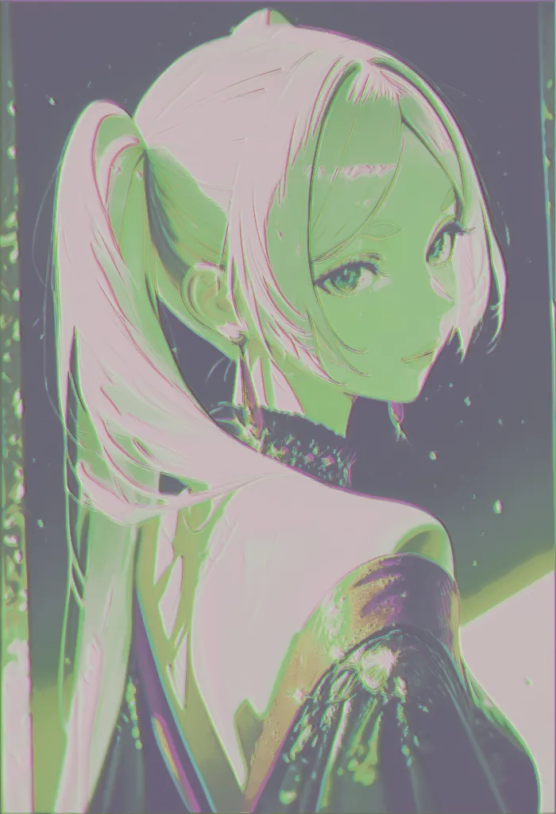
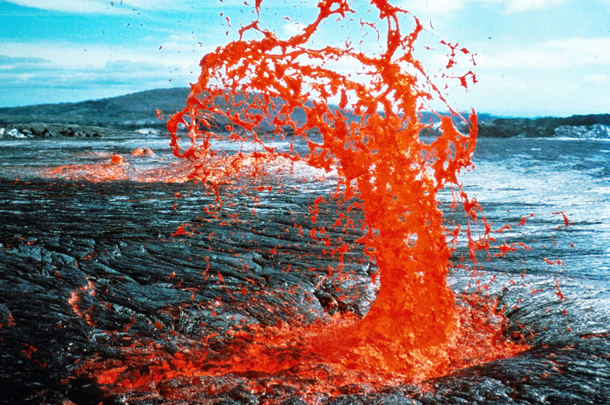
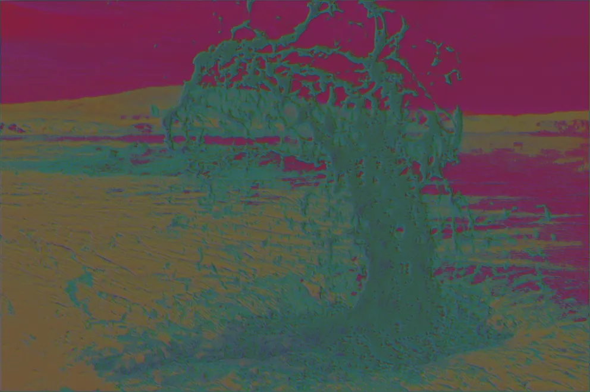
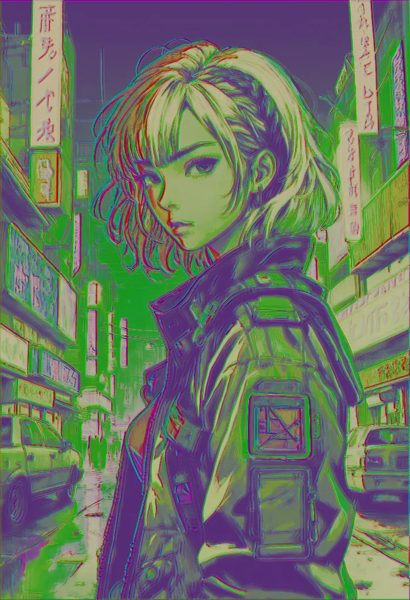

# FrequencyNet: A Dual-Domain Signal Processing Architecture

FrequencyNet is an advanced signal processing system that combines spatial and frequency domain transformations to enhance images. Inspired by StyleGAN3's alias-free design principles, FrequencyNet implements mathematical transforms for image enhancement.

## Key Features

- **Pure Mathematical Processing**: Uses Fourier transforms and signal processing - no training required
- **Dual-Domain Processing**: Mathematical operations in both spatial and frequency domains
- **Adaptive Frequency Masking**: Separate processing paths for luminance and chrominance using wavelet transforms
- **Signal Continuity**: Advanced filtering based on signal processing theory
- **Translation & Rotation Equivariance**: Mathematically guaranteed transform consistency
- **Lightweight Implementation**: Fast execution through optimized FFT operations
- **Real-time Processing**: Suitable for live video and streaming applications

## How It Works

FrequencyNet is a mathematical signal processor that uses:

1. **Fourier Domain Processing**:
   - Fast Fourier Transform (FFT) decomposes images into frequency components
   - Frequency-selective filters enhance desired features
   - Pure mathematical transformations - no training or learning involved

2. **Fixed Mathematical Components**:
   - Low-pass filters prevent aliasing artifacts
   - Frequency masking based on human vision research
   - Adaptive thresholding using statistical methods

3. **Signal Blending**:
   - Mathematical blending of spatial and frequency components
   - Fixed ratio (α = 0.7) determined through empirical testing
   - Deterministic results - same input always produces same output

Think of FrequencyNet like advanced Photoshop filters - it's built on mathematical principles rather than machine learning. The optional "training mode" exists only for specialized cases where you want to:
- Custom-tune the frequency filters
- Create artistic effects
- Build specialized image transformations

## Example Input and Output

Here’s how FrequencyNet processes an image:

| Input Image | Output Image |
|------------|-------------|
|  |  |
|  |  |
|  |  |

## Requirements

- Python 3.6+
- PyTorch 1.7+
- torchvision
- PIL (Pillow)
- numpy
- gradio (for the interactive demo)
- CycleGAN repository (from https://github.com/junyanz/pytorch-CycleGAN-and-pix2pix)

## Installation

1. Clone this repository:
```bash
git clone https://github.com/Ollama-Agent-Roll-Cage/frequency-net
cd frequency-net
```

2. Create and activate a virtual environment:

Windows:
```bash
python -m venv venv
.\venv\Scripts\activate
```

Linux/MacOS:
```bash
python3 -m venv venv
source venv/bin/activate
```

3. Install requirements:
```bash
pip install --upgrade pip
pip install torch torchvision --index-url https://download.pytorch.org/whl/cu126
pip install pillow numpy gradio tqdm opencv-python

# Virtual camera support
pip install pyvirtualcam

# For screen capture on Linux/MacOS:
pip install mss
```

4. Optional: For CycleGAN integration:
```bash
# next to the FrequencyNet Repo clone the cycleGAN repo and create the cycleGAN ENV variable
git clone https://github.com/junyanz/pytorch-CycleGAN-and-pix2pix ../pytorch-CycleGAN-and-pix2pix
cd ../pytorch-CycleGAN-and-pix2pix
pip install -r requirements.txt
cd ../frequency-net

set env var for shared cycleGAN repo
```

To deactivate the virtual environment when you're done:
```bash
deactivate
```

Note: Replace `cu126` in the PyTorch install command with your CUDA version if different. For CPU-only installation, remove `--index-url` and everything after it.

## Usage

FrequencyNet can be used in two ways:

### 1. Mathematical Processing Mode (Default)
This is the primary mode that uses pure signal processing:

```bash
python frequency_net.py --mode preprocess --input_dir path/to/images --output_dir path/to/output
```

Key aspects:
- No training required - works immediately
- Uses Fourier transforms and frequency domain filters
- Deterministic results for same input
- Suitable for most image enhancement tasks

### 2. Custom Filter Training (Optional)
Only needed if you want to customize the frequency response:

```bash
python frequency_net.py --mode train \
    --train_dir path/to/training/images \
    --val_dir path/to/validation/images \
    --output_model_path path/to/model.pth \
    --epochs 10 \
    --batch_size 4
```

Training is optional and only useful for:
- Fine-tuning frequency filters for specific styles
- Creating custom artistic effects
- Specialized image transformations

### Interactive Demo

For real-time experimentation:
```bash
python gradio-demo.py
```

The demo interface lets you adjust:
- Image resolution and processing strength
- Frequency domain parameters
- Color and detail enhancement settings

### Real-time Video Processing

Process webcam or screen capture with virtual camera output:
```bash
python frequency_net_webcam.py

### Batch Processing

Process multiple images:
```bash
python batch-processor.py --mode process \
    --input_dir path/to/input \
    --output_dir path/to/output \
    --batch_size 4
```

Create comparisons:
```bash
python batch-processor.py --mode process \
    --input_dir path/to/input \
    --output_dir path/to/output \
    --batch_size 4 \
    --model_path path/to/model.pth  # optional

python batch-processor.py --mode compare \
    --input_dir path/to/input \
    --output_dir path/to/processed \
    --comparison_dir path/to/comparisons \
    --num_samples 5  # optional
```

### Real-time Video Processing

For webcam or screen capture:
```bash
python frequency_net_webcam.py
```

Features:
- Real-time FFT-based processing
- Virtual camera output
- Adjustable parameters while running

### CycleGAN Integration

1. Prepare your dataset for CycleGAN:
```bash
python cyclegan-integration.py --mode prepare --input_dir path/to/original/dataset --dataset_name your_dataset_name
```

2. Train CycleGAN with FrequencyNet preprocessing:
```bash
python cyclegan-integration.py --mode train --input_dir path/to/original/dataset --dataset_name your_dataset_name --cyclegan_path path/to/cyclegan/repo
```

## Acknowledgments

- This implementation is inspired by the [StyleGAN3 paper](https://nvlabs.github.io/stylegan3/) by Karras et al. and the [official StyleGAN3 implementation](https://github.com/NVlabs/stylegan3)
- CycleGAN implementation from [Zhu et al.](https://github.com/junyanz/pytorch-CycleGAN-and-pix2pix)

## Citation

If you use this model in your research, please cite our work and the original StyleGAN3 paper:

```bibtex
@inproceedings{Karras2021,
  author = {Tero Karras and Miika Aittala and Samuli Laine and Erik H\"ark\"onen and Janne Hellsten and Jaakko Lehtinen and Timo Aila},
  title = {Alias-Free Generative Adversarial Networks},
  booktitle = {Proc. NeurIPS},
  year = {2021}
}
```

StyleGAN3 official implementation: [https://github.com/NVlabs/stylegan3](https://github.com/NVlabs/stylegan3)
